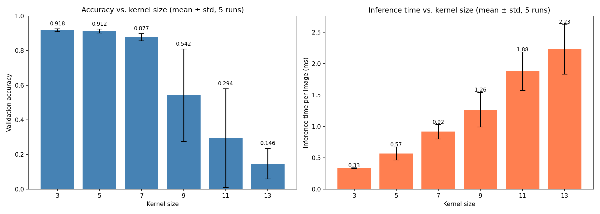
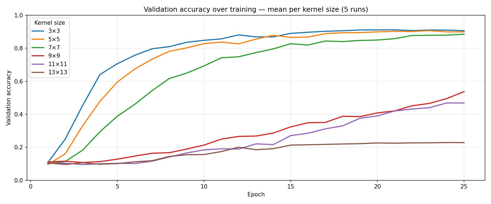
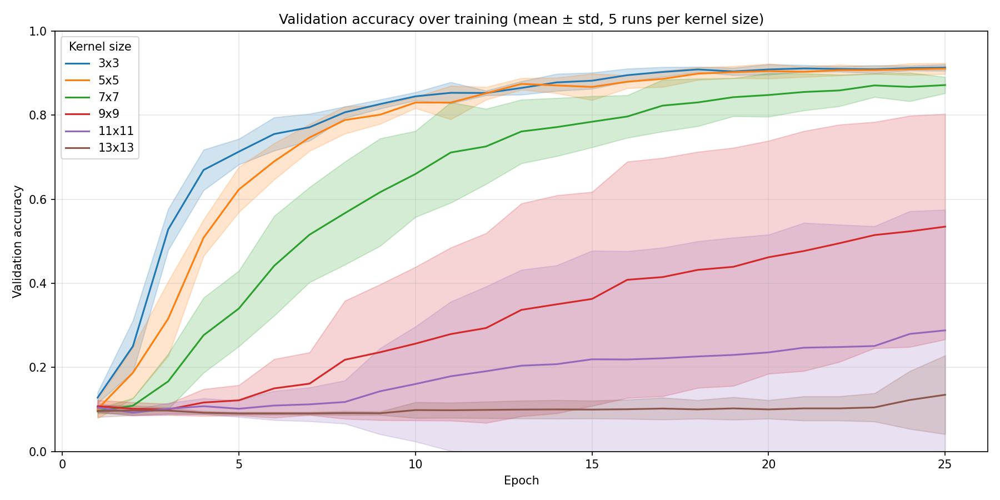
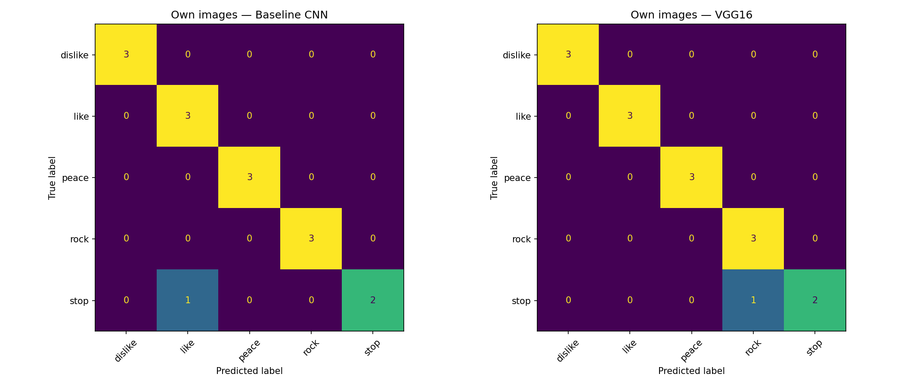

[](https://classroom.github.com/a/cMaQVOgt)


# Assignment 5: Hand Pose Detection with a CNN

## Setup
1. Clone the repo and navigate to it via `cd assignment-05-cnn-Alphazerfall`.
2. Set up a virtual environment by running `python -m venv .venv`.
3. Activate the virtual environment using `.venv\Scripts\activate` on Windows and `source .venv/bin/activate` on Linux/Mac.
4. Install the required dependencies via `pip install -r requirements.txt`.
5. Place the HaGRID dataset sample (provided via GRIPS) in a folder called `data/` at the repo root. It should contain gesture subfolders (`like/`, `dislike/`, ...) and an `_annotations/` folder.

## 1. Exploring Hyperparameters

Kernel size was compared across all three convolution layers in [`01-hyperparameters/hyperparameters.ipynb`](01-hyperparameters/hyperparameters.ipynb).

### Approach & Assumptions

The original course notebook used only 2 gesture categories (`like`, `stop`). Here all 10 available categories are used (`dislike`, `fist`, `like`, `ok`, `one`, `peace`, `rock`, `stop`, `three`, `two_up`), since a harder problem should show the effect of kernel size more clearly.

All other hyperparameters are kept fixed (`batch_size=8`, `activation_conv=leaky_relu`, `activation=relu`, `layer_count=2`, `num_neurons=64`). The kernel size is changed uniformly across all three convolution layers to isolate its effect.

All runs train for the same fixed number of epochs (25) without early stopping. Only `ReduceLROnPlateau` is kept so the learning rate can adapt the same way in all runs. Without this, small kernels that converge quickly would train for 20 to 30 epochs while large kernels that fail to learn would stop after 5, which would make the comparison meaningless.

Each kernel size is trained 5 times and the results are reported as mean and standard deviation, since large kernels turned out to be very sensitive to random initialisation. In a first single-run test, 13x13 looked like it performed well (~0.82) while 9x9 and 11x11 failed completely (~0.10). After repeating the runs the picture reversed: 13x13 consistently failed while 9x9 and 11x11 just showed high variance. So a single run would have been pure luck.

**Tested values:** 3x3, 5x5, 7x7, 9x9, 11x11, 13x13

**Assumptions before training:**
- Accuracy should decrease with larger kernels.
- Inference time should increase with kernel size.
- Parameter count should grow quadratically with kernel size.

### Findings & Discussion







| Kernel | Val accuracy | Std   | ms / img | Std  | Params  |
|--------|-------------|-------|----------|------|---------|
| 3×3    | 0.915       | 0.009 | 0.80     | 0.14 | 52,810  |
| 5×5    | 0.908       | 0.021 | 0.88     | 0.08 | 105,034 |
| 7×7    | 0.888       | 0.004 | 1.69     | 0.76 | 183,370 |
| 9×9    | 0.540       | 0.171 | 2.10     | 0.17 | 287,818 |
| 11×11  | 0.474       | 0.307 | 2.48     | 0.31 | 418,378 |
| 13×13  | 0.244       | 0.273 | 2.89     | 0.19 | 575,050 |


**Accuracy:** Small kernels (3x3 to 7x7) worked best, all reaching around 90% validation accuracy and converging reliably. From 9x9 on, accuracy dropped sharply. The large kernels were also very unstable, some runs learned something while others got stuck near random guessing, which is visible in the large error bars. This is why averaging over multiple runs was important, a single run would have been misleading.

**Inference time and parameters:** Both grow with kernel size as expected. The parameter count grows roughly quadratically because the kernel area scales with the width squared.

**Explanation:** The input images are only 64x64 and get pooled aggressively after each convolution layer. A 9x9 or larger kernel covers a big part of the feature map at once, so the network can no longer pick up small local patterns like finger edges, which is exactly what is needed to tell hand gestures apart.

**Conclusion:** I assumed accuracy would decrease gradually with kernel size, but instead there is a sharp break between 7x7 and 9x9. Kernel size 3x3 is the clear winner with the best accuracy, shortest inference time and fewest parameters. This also matches common practice, since modern CNN architectures almost always use small odd-sized kernels, usually 3x3, as explained in [this post](https://medium.com/data-science/deciding-optimal-filter-size-for-cnns-d6f7b56f9363).

## 2. Gathering a Dataset

### Image Capture

Five gesture categories (**like**, **dislike**, **stop**, **rock**, **peace**) were recorded across three locations. Images were captured with an **iPhone 13 Pro** (portrait, resized to 1080×1920 or 1440×1920) and a **Logitech C920 Pro** webcam (1920×1080 landscape). All images are stored in `02-dataset/data_felix/`.

### Results

Confusion matrices on the HaGRID test split and on the recorded images:



| Model | Train Accuracy | Val Accuracy | Val Loss |
|-------|---------------|--------------|----------|
| Baseline CNN | 96.50 % | 94.80 % | 0.1832 |
| VGG-based CNN | 99.50 % | 89.20 % | 0.3088 |

The Baseline CNN is the sequential model provided in the course (3x Conv2D + MaxPooling, Dropout, 2x Dense). The baseline performs better on the validation set even though it is simpler. The VGG model scores higher on training but drops off on validation, suggesting it is overfitting. The Baseline CNN also has far fewer parameters, 297k (1.13 MB) compared to 15.3M (58.4 MB), making it faster and lighter.

### Annotation tool (`02-dataset/annotate.py`)

Expects images organised in gesture subfolders (same layout as HaGRID):

```
02-dataset/data_felix/
    dislike/  img1.jpg  img2.jpg  ...
    like/     ...
    peace/    ...
    ...
```

The gesture label is inferred from the subfolder name, so the first box drawn is automatically labelled with that gesture. Additional boxes default to `no_gesture`.

**Annotate your own photos:**
```bash
python 02-dataset/annotate.py --images 02-dataset/data_felix/ --output 02-dataset/annot-felix.json
```

**View HaGRID annotations (read-only):**
```bash
# All gestures
python 02-dataset/annotate.py --images data/ --load data/_annotations/ --readonly

# Single gesture
python 02-dataset/annotate.py --images data/ --load data/_annotations/stop.json --readonly
```

**Controls:**

| Key | Action |
|-----|--------|
| `1`–`9`, `0` | Select gesture label (like, dislike, stop, rock, peace, fist, ok, one, three, two_up) |
| `N` | Select `no_gesture` |
| Drag | Draw bounding box around a hand |
| `Z` | Undo last box |
| `S` | Save & advance to next image (advance only in `--readonly`) |
| `Q` | Save & quit |

## 3. Gesture-controlled Camera App

The app uses the [MediaPipe Hand Landmarker](https://developers.google.com/edge/mediapipe/solutions/vision/hand_landmarker) to locate the hand in the frame and extract a crop, which is then passed to the gesture classifier. Only one hand is tracked at a time. The model file (~7.5 MB) is downloaded automatically on first run and cached in `03-camera-app/`.

```bash
python 03-camera-app/camera_app.py --time 5 --path selfie.jpg
```

| Argument | Default | Description |
|----------|---------|-------------|
| `--camera` | `0` | Camera device ID |
| `--time` | `3.0` | Countdown duration in seconds |
| `--path` | `selfie.jpg` | File path for the saved image |

After capture the app pauses for 2.5 seconds showing "Saved!" before accepting new gestures. Gestures must be held for ~4 frames before they register.

| Key | Gesture equivalent | Action |
|-----|--------------------|--------|
| `Space` | Thumbs up | Start countdown |
| `Esc` | Thumbs down | Cancel countdown |
| `C` | Rock | Toggle chromatic aberration |
| `E` | Peace | Toggle long exposure |
| `D` | — | Toggle hand crop debug window |
| `Q` | — | Quit |

**Chromatic aberration** (Rock / `C`) — splits the colour channels horizontally, giving a glitchy RGB fringe effect.

**Long exposure** (Peace / `E`) — blends each frame into a float accumulator, ghosting moving objects while keeping static parts sharp. The effect fades over roughly one second.